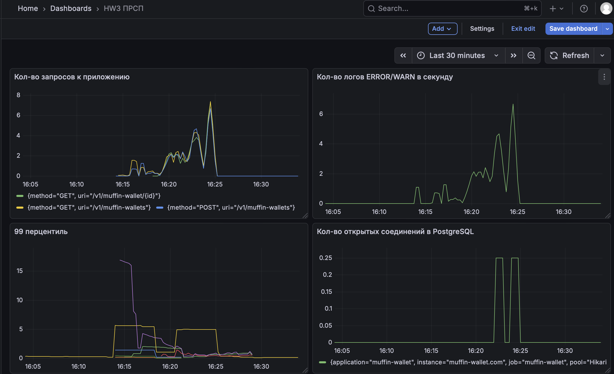

## Что я делал?
> P.S. Это шаблон с большого ДЗ-2. Поэтому тут много лишних файлов, также я не стал удалять часть с istio, ее можно просто пропустить

> P.S.2. Я изначально пытался делать оператор в k8s, но у меня не сильно много чего получилось, поэтому я сделал Docker. Поэтому тут где-то есть остатки решения из Кубера.

1. Поднять миникуб
```yaml
minikube delete --all --purge 

minikube start --driver=docker
minikube addons enable ingress
```

2. Поднял БД в Docker Базу Данных и Prometheus и Grafana. 
Важно! В /etc/hosts должен быть резолв muffin-wallet.com. Я в Docker Compose подшаманил, чтобы под мог резолвить muffin-wallet.com/actuator/prometheus.

```yaml
docker-compose up -d
```

3. Поднял с помощью Helmfile muffin-wallet
```yaml
cd muffin-wallet
helmfile apply
```

если надо убить helm release: helmfile destroy

4. Поднял с помощью Helmfile muffin-currency
```yaml
cd muffin-currency
```

если надо убить helm release: helmfile destroy

5. Устанавливаем istio, включаем автоматическую инжекцию sidecar-прокси
```yaml
brew install istioctl

-- В Demo Prometheus, Grafana, Kiali, Jaeger!! автоматом все установилось
istioctl install --set profile=demo -y

kubectl label namespace default istio-injection=enabled --overwrite
kubectl rollout restart deployment -n default

```

6. Сделал ямлик Istio Gateway (в корневой папке)
```yaml
kubectl apply -f gateway/gateway.yaml
```

7. Сделал ямлики VirtualService Wallet и Currency -- надо сделать apply
```yaml
cd muffin-wallet
kubectl apply -f virtual-service-wallet.yaml

cd ..

cd muffin-currency
kubectl apply -f virtual-service-currency.yaml
```

8. сделать туннель
```shell
minikube addons enable ingress
kubectl logs -n ingress-nginx -l app.kubernetes.io/name=ingress-nginx
sudo minikube tunnel
```

9. Маршрутизация готова:
```yaml
muffin-wallet.com
muffin-currency.com
```

10. Настроим в графане подключение к прометеусу


Тут "Add new data source", дальше выбираем тип источника "Prometheus" и по URL "http://prometheus:9090" подсоединяемся к прометеусу (графана и пром в одной сети)

## Как проверить работоспособность всех компонентов системы.
Для подов в k8s должен проходить хэлсчек. Посмотреть это можно через UI k8s или через команду:
```yaml
kubectl get pods -o wide
```

Для докера также нужно посмотреть хэлсчек:
```yaml
docker ps
```

## Запросы
Я сделал дашборд в Графана, [отгрузил его json-ину сюда](dashboard.json), но дублирую запросы тут.

Также эти метрики можно забить просто в UI Графаны (раздел Explore) или в [UI Prometheus](http://localhost:9090/query)

### Количество запросов в секунду по каждому методу REST API вашего приложения.
```promql
sum by (uri, method) (
  rate(http_server_requests_seconds_count{job="muffin-wallet", uri=~"/v1/muffin-wallet.*"}[1m])
)
```

### Количество ошибок в логах приложения.
```promql
sum(rate(logback_events_total{level=~"warn|error",}[1m]))
```

Здесь сделал через частоту в секунду

## 99-й персентиль времени ответа HTTP (обработка запросов).
```promql
histogram_quantile(0.95, 
  sum by(le, uri) (
    rate(http_server_requests_seconds_bucket[5m])
  )
)
```

## Количество активных соединений к базе данных PostgreSQL.
```promql
sum_over_time(hikaricp_connections_active{instance="muffin-wallet.com"}[1m])
```

## Итог


## Как посмотреть правильность?
Можно дать нагрузки на сервис и посмотреть на корректность метрик. Я написал [скрипт на питоне](load.py), можно его запустить и посмотреть на корректность. С ростом RPS (количество тредов в пуле), должны расти и графики :)