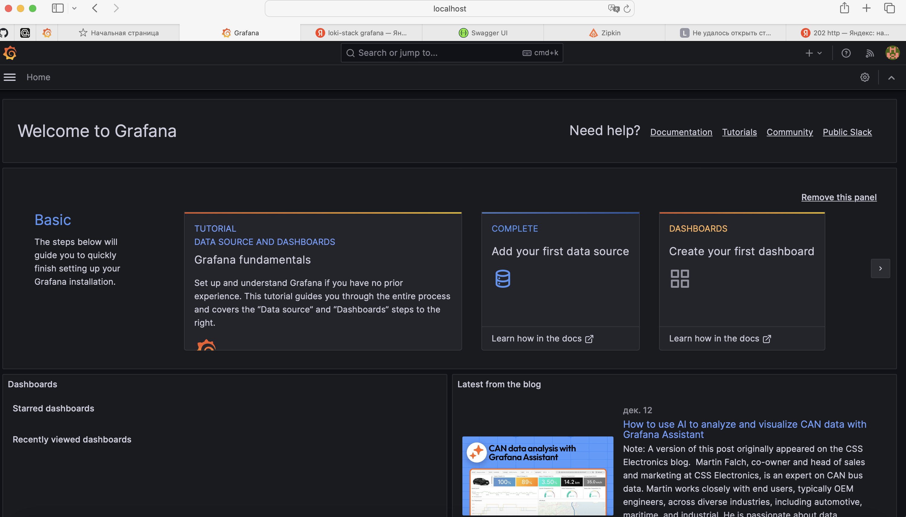
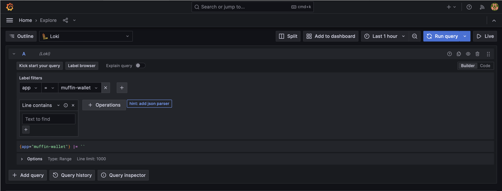
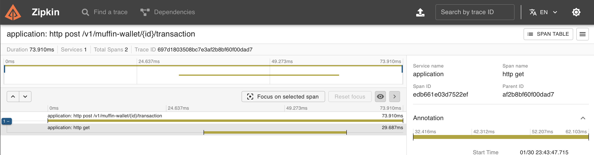
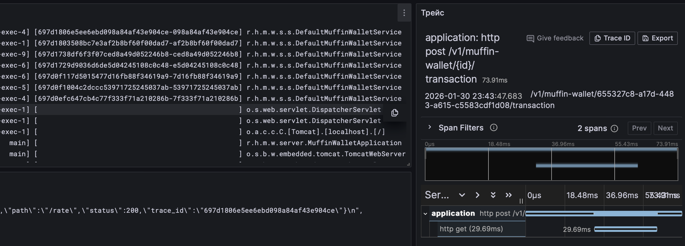
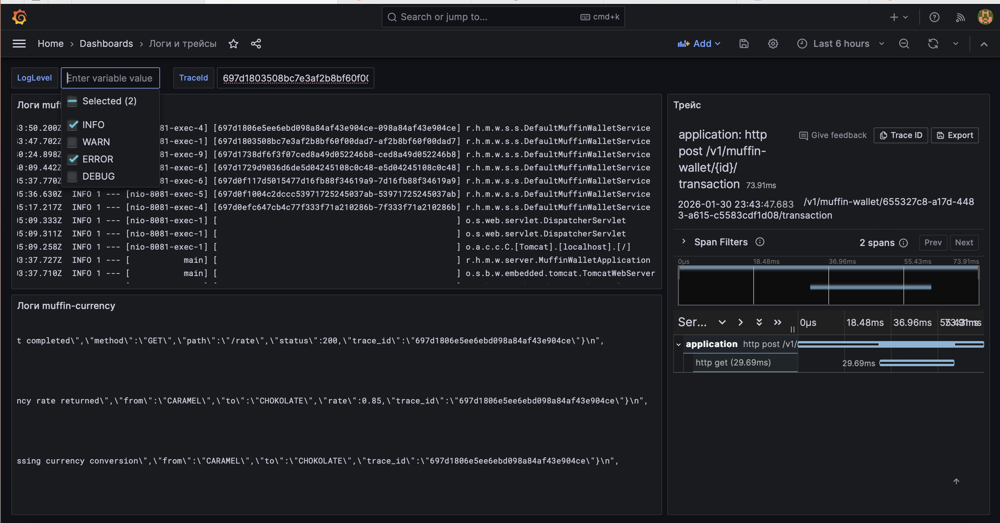

# Илья Тямин
## Что я делал?

> P.S. Это шаблон с большого ДЗ-2 и ДЗ-1 с второго семестра. Поэтому тут много лишних файлов, также я не стал удалять часть с istio, ее можно просто пропустить

1. Поднять миникуб
```yaml
minikube delete --all --purge 

minikube start --driver=docker
minikube addons enable ingress
```

2. Поднял БД в Docker Базу Данных (и по совместительству Prometheus).
Важно! В /etc/hosts должен быть резолв muffin-wallet.com.

```yaml
docker-compose up -d
```

3. Для того чтобы правильно работал трейсинг, нам нужно пересобрать muffin-currency и запушить в свой локальный Docker Hub. 

(в самом muffin-currency вместо URL трейсинга стоит http://localhost:8080). Заменяем строку на
```gotemplate
err := initTracing("currency-service", "http://zipkin.wallet-monitoring.svc.cluster.local:9411/api/v2/spans")
```

Также там в коде на Go была какая-то проблема с трейсингом (все время создавались новые спаны). Я поправил и запушил в свой Docker Hub: `tyaminilya/muffin-currency:1.2.0`

Почему такой адрес -- станет ясно позже (я разверну Zipkin в неймспейсе wallet-monitoring).

Как собрать и запушить все в Docker Hub:
```shell
docker build -t muffin-currency:1.1.1 .

docker login

docker tag muffin-currency:1.1.1 tyaminilya/muffin-currency:1.1.1

docker push tyaminilya/muffin-currency:1.1.1
```

Аналогично, мне требовалось пересобрать muffin-wallet (но потом оказалось, что это не надо, так как путь до Zipkin можно указать как переменная окружения)
```shell
docker build -t muffin-wallet:1.1.1 .

docker login

docker tag muffin-wallet:1.1.1 tyaminilya/muffin-wallet:1.1.1

docker push tyaminilya/muffin-wallet:1.1.1
```

3. Поднял с помощью Helmfile muffin-wallet
```yaml
cd muffin-wallet
helmfile apply
```

ПЕРЕД ЭТИМ (!!!!!) я добавил в muffin-wallet/values.yaml в раздел env
```yaml
  - name: MANAGEMENT_ZIPKIN_TRACING_ENDPOINT
    value: "http://zipkin.wallet-monitoring.svc.cluster.local:9411/api/v2/spans"
  - name: MANAGEMENT_ZIPKIN_TRACING_CONNECT_TIMEOUT
    value: 5s
  - name: MANAGEMENT_ZIPKIN_TRACING_READ_TIMEOUT
    value: 5s
  - name: MANAGEMENT_ZIPKIN_TRACING_MESSAGE_TIMEOUT
    value: 5s
```
Это нужно для корректной работы трейсинга (его настраивать будем позже)

если надо убить helm release: helmfile destroy

4. Поднял с помощью Helmfile muffin-currency
```yaml
cd muffin-currency
helmfile apply
```

если надо убить helm release: helmfile destroy

5. Устанавливаем istio, включаем автоматическую инжекцию sidecar-прокси
```yaml
brew install istioctl

-- В Demo Prometheus, Grafana, Kiali, Jaeger!! автоматом все установилось
istioctl install --set profile=demo -y

kubectl label namespace default istio-injection=enabled --overwrite
kubectl rollout restart deployment -n default

```

6. Сделал ямлик Istio Gateway (в корневой папке)
```yaml
kubectl apply -f gateway/gateway.yaml
```

7. Сделал ямлики VirtualService Wallet и Currency -- надо сделать apply
```yaml
kubectl apply -f muffin-wallet/virtual-service-wallet.yaml
kubectl apply -f muffin-currency/virtual-service-currency.yaml
```

8. сделать туннель
```shell
minikube addons enable ingress
kubectl logs -n ingress-nginx -l app.kubernetes.io/name=ingress-nginx
sudo minikube tunnel
```

9. Маршрутизация готова:
```yaml
muffin-wallet.com
muffin-currency.com
```

10. Поставим Grafana Stack в k8s
```yaml
helm repo add grafana https://grafana.github.io/helm-charts

helm install loki grafana/loki-stack \
--namespace wallet-monitoring \
--create-namespace \
--set promtail.enabled=true \
--set grafana.enabled=true \
--set grafana.adminPassword=admin123 \
--set grafana.service.type=NodePort \
--set loki.persistence.enabled=false

helm upgrade --install loki grafana/loki-stack \
--namespace wallet-monitoring \
--create-namespace \
--set promtail.enabled=true \
--set grafana.enabled=true \
--set grafana.adminPassword=admin123 \
--set grafana.service.type=NodePort \
--set loki.persistence.enabled=false \
--set 'promtail.config.clients[0].url=http://loki.wallet-monitoring.svc.cluster.local:3100/loki/api/v1/push'
```
Тут 2 команды у меня специально, чтобы promtail смог найти норм путь до loki и зарезолвить его.

Поднялась графана. Есть 2 пути как отобразить ее UI (легкий и простой):

Легкий -- сделать port-forward:
```shell
kubectl port-forward deployment/loki-grafana 3000 3000 -n wallet-monitoring
```

Сложный -- сделать Ingress:
```shell
cd monitoring
kubectl apply -f grafana-ingress.yaml 
minikube tunnel
```
В /etc/hosts надо будет добавить `192.168.49.2 grafana.local`

Вот она, графана (пароль admin123):


Loki будет автоматически подключен к Grafana. Также Loki будет автоматически скрэппить логи со всех подов k8s.

Это можно посмотреть в разделе Explore:



11. Поднимем zipkin в том же неймспейсе:
```shell
helm repo add zipkin https://zipkin.io/zipkin-helm
helm install zipkin zipkin/zipkin --namespace wallet-monitoring
```

Сделаем port-forward на порт 9411:
```shell
kubectl port-forward deployment/zipkin 9411 9411 -n wallet-monitoring
```

12. Сделаем пару запросов на `muffin-wallet`, чтобы запросы доходили до `muffin-currency` (перевод денег). Посмотрим трейс в UI Zipkin:


Ура! Все работает!

Также запросам muffin-currency приписываются `trace_id` и `span_id`:


13. Сделаем дашборд в Grafana. Не буду подробно объяснять как я его делал (использовал Variables в дашборде и инжектил их через $NameOfVariable)

Дополнительно я прикрепил [JSON дашборда](dashboard.json) в корень репозитория. В дашборде можно выбрать по кнопке уровень логов и логи обоих контейнеров отфильтруются по уровню, а также указать traceId и справа отобразится информация о трейсе.

